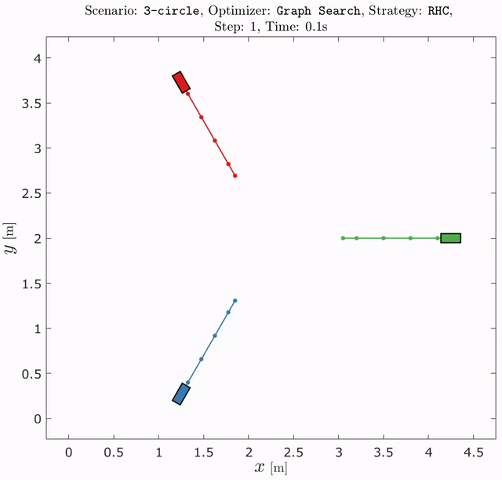

# Priority-Based Trajectory Planning for Networked Vehicles Using Motion Primitives

[](https://matlab.mathworks.com/open/github/v1?repo=embedded-software-laboratory/p-dmpc&project=graph_based_planning.prj&file=main.m)

- [Priority-Based Trajectory Planning for Networked Vehicles Using Motion Primitives](#priority-based-trajectory-planning-for-networked-vehicles-using-motion-primitives)
- [Setup](#setup)
  - [MATLAB R2023a](#matlab-r2023a)
  - [System Requirements for MATLAB ROS Toolbox](#system-requirements-for-matlab-ros-toolbox)
  - [Setup Details](#setup-details)
- [Experiments](#experiments)
- [References](#references)
- [Acknowledgements](#acknowledgements)

# Setup

The following setup instructions are intended for Ubuntu 18.04. You can find more detailed information on the setup in Ubuntu 18.04 and other OSs with the link at the end of this section.

## MATLAB R2023a

Install MATLAB R2023a with the following toolboxes:

- Matlab Coder
- Parallel Computing Toolbox
- Statistics and Machine Learning Toolbox
- ROS Toolbox

## System Requirements for MATLAB ROS Toolbox

In our priority-based trajectory planning, vehicles communicate using the MATLAB ROS toolbox. Their custom messages are compiled with the MATLAB built-in function `ros2genmsg()`, for which you must have Python software, CMake software, and a C++ compiler for your platform ([ROS Toolbox Requirements](https://de.mathworks.com/help/ros/gs/ros-system-requirements.html)).
For MATLAB R2023a

- Python
  1. Install Python 3.8 <br>
     `sudo apt install python3.8 python3.8-venv python3.8-dev`
  2. Setup Python in the MATLAB command window: <br>
     `pyenv(Version="3.8")`
  3. If Matlab cannot find Python, try: <br>
     `pyenv(Version=/usr/bin/python3.8)`
- C++ compiler
  1. Install GCC and G++ Version 7.x+ <br>
     `sudo apt install gcc-7 g++-7`
  2. Set them as the default compiler <br>
     `sudo update-alternatives --install /usr/bin/gcc gcc /usr/bin/gcc-7 70 --slave /usr/bin/g++ g++ /usr/bin/g++-7`
  3. Setup the compiler in the MATLAB command window: <br>
     `mex -setup`

## Setup Details

More detailed information including troubleshooting can be found [here](./docs/Setup_Details.md).

# Experiments

1. Execute startup.m to open the project
   - Compilation of graph_search_mex should fail
   - Compilation of lanelet2_interface should fail
   - Compilation of priority_queue should succeed
2. Execute main.m to run an experiment
   - Select the environment Simulation
   - Select the control strategy pb non-coop
   - Push the Start button to start the experiment
   - Options that does not work in this setup are:
     - Environments: CPM Lab, Unified Lab API
     - Checkbox: use C++
     - Scenario: Lanelet2, Lab Default

More detailed information including lab experiments can be found [here](./docs/Run_Experiments.md).

# References

Please refer to the respective publication if you are using it for your work. Thank you very much!

<details>
<summary>
P. Scheffe, J. Xu and B. Alrifaee, "Limiting Computation Levels in Prioritized Trajectory Planning with Safety Guarantees", 2024 European Control Conference (ECC), Stockholm, Sweden, 2024, doi: 10.23919/ECC64448.2024.10591179
<br>

<!-- icons from https://simpleicons.org/ -->

[](https://doi.org/10.23919/ECC64448.2024.10591179)
[](https://github.com/embedded-software-laboratory/p-dmpc/tree/v5.0)
[](https://youtu.be/alGHLwQQpHI)

</summary>
<p>

Checkout the [the software version 5.0](https://github.com/embedded-software-laboratory/p-dmpc/tree/v5.0).
The results of the publication can be reproduced by running

```matlab
open graph_based_planning.prj
eval_parallel_computation_prediction_inconsistency()
eval_parallel_computation_CLs()
```

The results are saved in the folder "results".

</p>
</details>

<details>
<summary>
P. Scheffe, J. Kahle and B. Alrifaee, "Reducing Computation Time with Priority Assignment in Distributed MPC," TechRxiv, Preprint, 2023, doi: 10.36227/techrxiv.20304015.v2
<br>

<!-- icons from https://simpleicons.org/ -->

[](https://doi.org/10.36227/techrxiv.20304015.v2)
[](https://github.com/embedded-software-laboratory/p-dmpc/tree/v4.0)

</summary>
<p>

Checkout the [the software version 4.0](https://github.com/embedded-software-laboratory/p-dmpc/tree/v4.0).
The results of the publication can be reproduced by running

```matlab
eval_coloring_paper()
```

This evaluation comprises 720 simulations, so it will take days until completion.
The results are saved in the folder "results".

</p>
</details>

<details>
<summary>
Scheffe, P., Pedrosa, M.V.A., Flaßkamp, K., Alrifaee, B. (2024). Prioritized Trajectory Planning for Networked Vehicles Using Motion Primitives. In: Stiller, C., Althoff, M., Burger, C., Deml, B., Eckstein, L., Flemisch, F. (eds) Cooperatively Interacting Vehicles. Springer, Cham. https://doi.org/10.1007/978-3-031-60494-2_9
<br>

<!-- icons from https://simpleicons.org/ -->

[](https://doi.org/10.1007/978-3-031-60494-2_9)
[](https://github.com/embedded-software-laboratory/p-dmpc/tree/v3.0)

</summary>
<p>

Checkout the [the software version 3.0](https://github.com/embedded-software-laboratory/p-dmpc/tree/v3.0).
The results of the publication can be reproduced by running

```matlab
open graph_based_planning.prj
spp_book()
```

The results are saved in the folder "results".

</p>
</details>

<details>
<summary>
P. Scheffe and B. Alrifaee, "A Scaled Experiment Platform to Study Interactions Between Humans and CAVs," 2023 IEEE Intelligent Vehicles Symposium (IV), Anchorage, AK, USA, 2023, doi: 10.1109/IV55152.2023.10186623.
<br>
This paper has won the Young Research Award of ITSS Germany 2023.
<br>

<!-- icons from https://simpleicons.org/ -->

[](https://doi.org/10.1109/IV55152.2023.10186623)
[](https://github.com/embedded-software-laboratory/p-dmpc/tree/v2.0)
[](https://youtu.be/kDIVu0tv9Ro)

</summary>
<p>

Checkout the [the software version 2.0](https://github.com/embedded-software-laboratory/p-dmpc/tree/v2.0).
The results of the publication can be reproduced by running

```matlab
hdv_reachable_set_experiment()
```

The results are saved in the folder "results".

</p>
</details>

<details>
<summary>
P. Scheffe, M. V. A. Pedrosa, K. Flaßkamp and B. Alrifaee, "Receding Horizon Control Using Graph Search for Multi-Agent Trajectory Planning", in IEEE Transactions on Control Systems Technology, 2022, doi: 10.1109/TCST.2022.3214718.
<br>

<!-- icons from https://simpleicons.org/ -->

[](https://doi.org/10.1109/TCST.2022.3214718)
[](https://github.com/embedded-software-laboratory/p-dmpc/tree/v1.0)
[](https://www.youtube.com/watch?v=7LB7I5SOpQE)
[](https://codeocean.com/capsule/7778016)

</summary>
<p>



Checkout the [the software version 1.0](https://github.com/embedded-software-laboratory/p-dmpc/tree/v1.0).
The results of the publication can be reproduced by running

```matlab
eval_rhgs()
```

The results are saved in the folder "results".

</p>
</details>

<details>
<summary>
P. Scheffe, G. Dorndorf, and B. Alrifaee, “Increasing Feasibility with Dynamic Priority Assignment in Distributed Trajectory Planning for Road Vehicles,” in IEEE International Conference on Intelligent Transportation Systems (ITSC), 2022, pp. 3873–3879. doi: 10.1109/ITSC55140.2022.9922028.
<br>

<!-- icons from https://simpleicons.org/ -->

[](https://doi.org/10.1109/ITSC55140.2022.9922028)
[](https://github.com/embedded-software-laboratory/cpm_lab)
[](https://youtu.be/RqwbHUwip10)

</summary>
<p>

The code is implemented in [the CPM Lab software repository](https://github.com/embedded-software-laboratory/cpm_lab). The High Level Controller is implemented in C++ and is named "dynamic_priorities".

</p>
</details>

<details>
<summary>
References in Bibtex format
</summary>
<p>

```bibtex
@Inbook{scheffe2024prioritized,
    author    = "Scheffe, Patrick and Pedrosa, Matheus V. A. and Fla{\ss}kamp, Kathrin and Alrifaee, Bassam",
    editor    = "Stiller, Christoph and Althoff, Matthias and Burger, Christoph and Deml, Barbara and Eckstein, Lutz and Flemisch, Frank",
    title     = "Prioritized Trajectory Planning for Networked Vehicles Using Motion Primitives",
    bookTitle = "Cooperatively Interacting Vehicles: Methods and Effects of Automated Cooperation in Traffic",
    year      = "2024",
    publisher = "Springer International Publishing",
    address   = "Cham",
    pages     = "253--275",
    isbn      = "978-3-031-60494-2",
    doi       = "10.1007/978-3-031-60494-2_9",
}

@inproceedings{scheffe2024limiting,
    author   = {Scheffe, Patrick and Xu, Jianye and Alrifaee, Bassam},
    booktitle= {2024 European Control Conference (ECC)},
    title    = {Limiting Computation Levels in Prioritized Trajectory Planning with Safety Guarantees},
    year     = {2024},
    volume   = {},
    number   = {},
    pages    = {297-304},
    keywords = {Couplings;Limiting;Trajectory planning;Computational modeling;Europe;Real-time systems;Planning},
    doi      = {10.23919/ECC64448.2024.10591179}
}


@article{scheffe2023reducing,
    author = {Patrick Scheffe and Julius Kahle and Bassam Alrifaee},
    title  = {Reducing Computation Time with Priority Assignment in Distributed MPC},
    year   = {2023},
    month  = {2},
    doi    = {10.36227/techrxiv.20304015.v2}
}

@inproceedings{scheffe2023scaled,
    title     = {A Scaled Experiment Platform to Study Interactions Between Humans and CAVs},
    author    = {Patrick Scheffe and Bassam Alrifaee},
    booktitle = {IEEE Intelligent Vehicles Symposium (IV)},
    year      = {2023}
    pages     = {1--6},
    doi       = {10.1109/IV55152.2023.10186623}
}

@article{scheffe2022receding,
    author  = {Patrick Scheffe and Matheus Vitor de Andrade Pedrosa and Kathrin Flaßkamp and Bassam Alrifaee},
    journal = {IEEE Transactions on Control Systems Technology},
    title   = {Receding Horizon Control Using Graph Search for Multi-Agent Trajectory Planning},
    year    = {2022},
    volume  = {},
    number  = {},
    pages   = {1-14},
    doi     = {10.1109/TCST.2022.3214718}
}

@inproceedings{scheffe2022increasing,
    title       = {Increasing {{Feasibility}} with {{Dynamic Priority Assignment}} in {{Distributed Trajectory Planning}} for {{Road Vehicles}}},
    booktitle   = {{{IEEE International Conference}} on {{Intelligent Transportation Systems}} ({{ITSC}})},
    author      = {Scheffe, Patrick and Dorndorf, Georg and Alrifaee, Bassam},
    year        = {2022},
    pages       = {3873--3879},
    doi         = {10.1109/ITSC55140.2022.9922028}
}

```

</p>
</details>

# Acknowledgements

This research is supported by the Deutsche Forschungsgemeinschaft (German Research Foundation) within the Priority Program SPP 1835 "Cooperative Interacting Automobiles" (grant number: KO 1430/17-1).
